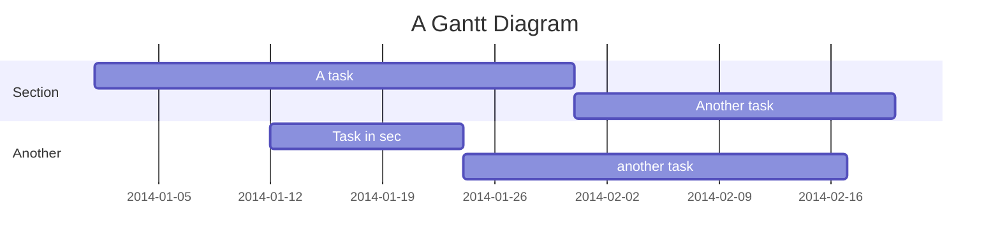

Here I  will introduce and explain the basic notation and special functions of markdown editor. 

# Basic Markdown notation

We will introduce the basic notation from Markdown


## Heading

By writing `#`, a half-width space, and a character string at the beginning of a line, it becomes a heading.
The number of `#` corresponds to the heading level.

```
# This is an h1 tag
## This is an h2 tag
### This is an h3 tag
#### This is an h4 tag
```
↓

## Bullet points

For a bulleted list, enter either `-` `*` and insert a half-width space or tab.
Inserting two or more half-width spaces or a tab at the beginning of a line will nest bullet points.

```
- List 1
- List 2
    - List 2a
         - List 2a1
    - List 2b
```
↓
- List 1
- List 2
    - List 2a
         - List 2a1
    - List 2b

## Numbered list
For a numbered list, enter `<number>.` or `<number>)` and insert a half-width space. Numbering will be done automatically starting from the first number specified.
If you insert two or more half-width spaces or a tab at the beginning of a line, the list will be nested.

```
2. foo
1. bar
1. base
    1. aaa
    1) bbb
    1. ccc
```

↓

2. foo
1. bar
1. base
    1. aaa
    1) bbb
    1. ccc

## Link

 `[Display text](URL)` becomes a link

```
[Click Here](https://www.link.com)
```
↓ 
[Click Here](https://www.shitalmainali.com.np)


## Automatic link

`URL` is a link.

However, please note that even if the URL is correct, if the end of the URL is as follows, it will not be an automatic link.
- `?`
- `!`
- `.`
-  `,`
-  `:`
-  `*`
-  `_`
-  `~`

For more information, see [6.9Autolinks (extension)](https://github.github.com/gfm/#autolinks-extension-) in [GitHub Flavored Markdown](https://github.github.com/gfm/). There is a detailed example.

## Image (img)

You can paste an image with ``

```

```
↓


If you want to specify the size, please use the `` tag :pray: (The `` tag is automatically inserted when you upload an image file.)

```

```


You can also attach images and files by copy-pasting them from the clipboard or by adding them into the editor.

## Quote (blockquote)

By inserting `>` at the beginning of a line, it can be displayed as a blockquote.

> This is blockquote
## Emphasis (bold/strong)

Emphasis (bold/strong) can be expressed by surrounding the text with two `*` or `_`.

```
That's my **bait**.
```
↓
That's my **bait**.

## Correction line (del)

A correction line (`del`) can be expressed by surrounding the wording with two `~`s.

```
It's food for the ~~dog~~ bird.
```
↓
It's food for the ~~dog~~ bird.

## Ruled line (hr)

A line containing only three or more `*` `-` and half-width spaces can be expressed as a ruled line (`hr`).

```
End of text.

---

Enjoy! ( ⁰⊖⁰ ) from this blog.io
```
↓
End of text.

---

Enjoy! ( ⁰⊖⁰ )

## Table

*The line before the table notation must be blank.

```
| Item name | Price |
| --- | --- |
| Dog food | 250 yen |
| Bird food | 128 yen |
```

↓

| Item name | Price |
| --- | --- |
| Dog food | 250 yen |
| Bird food | 128 yen |

If you want to create a line break within a cell, please use the `<br>` tag.

```
| Item name | Price |
| --- | --- |
| Dog <br>Food | 250 yen |
| Bird <br>Food | 128 yen |
```

↓

| Item name | Price |
| --- | --- |
| Dog <br>Food | 250 yen |
| Bird <br>Food | 128 yen |

The default in a cell is left-aligned, but you can center or right-align it by separating it from the header line with `:---:` or `---:`.

```
| Item name | Price | Notes |
| --- | :---: | ---: | 
| Dog food | 250 yen | Tax included |
| Bird food | 128 yen | Tax included |
| (Left alignment) | (Center alignment) | (Right alignment) |
```
↓

| Item name | Price | Notes |
| --- | :---: | ---: |
| Dog food | 250 yen | Tax included |
| Bird food | 128 yen | Tax included |
| (Left alignment) | (Center alignment) | (Right alignment) |


If you want to specify the column width, please use the `<table>` tag :pray:

```HTML
<table>
  <tr><th width="20">ID</th><th width="780">Item</th></tr>
  <tr><td>1</td><td>Dog food</td></tr>
   <tr><td>1</td><td>Dog food</td></tr>
</table>
```

<table>
  <tr><th width="40">ID</th><th width="760">Item</th></tr>
  <tr><td>1</td><td>Dog food</td></tr>
   <tr><td>1</td><td>Dog food</td></tr>
</table>


## Code (code / pre)

### Inline display

```
Inline code is the `<code>` tag.
```
↓
Inline code is the `<code>` tag.

### Code block display

<pre>
```
$ git push origin master
```

</pre>

↓
```
$ git push origin master
```
### Syntax highlighting 

<pre>
```ruby
def hex
  puts "( ⁰⊖⁰ )"
end
```

</pre>
↓

```ruby
def hex
  puts "( ⁰⊖⁰ )"
end
```


### File name display <span class="esa-extended">Extended notation</span>

<pre>

```ruby:Gemfile
gem 'rails'
gem 'that'
```

```ruby:tori.rb
puts '( ⁰⊖⁰ )'
```

</pre>

```ruby:Gemfile
gem 'rails'
gem 'that'
```

```ruby:tori.rb
puts '( ⁰⊖⁰ )'
```


## Escape

You can escape symbols used in Makdown with `\ `.

```
\# Hoge

\- high

\\high

(\\( ⁰⊖⁰)/)
```
↓

\# Hoge

\- high

\\high

(\\( ⁰⊖⁰)/)

# Formulas (MathJax/TeX)

## math code block

    ```math
     e^{i \pi} = -1
    ```

```math
 e^{i \pi} = -1
```

## inlineMath

    $a = \\{1, 2, 3\\}$
$a = \\{1, 2, 3\\}$

    $p^{foo}\_{i\\_{bar}}$
$p^{foo}\_{i\_{bar}}$

## [Mermaid](https://mermaidjs.github.io/)

Using Mermaid notation, you can embed Gantt charts etc. into mardkown articles.

    ```mermaid
    gantt
        title A Gantt Diagram
        dateFormat  YYYY-MM-DD
        section Section
        A task           :a1, 2014-01-01, 30d
        Another task     :after a1  , 20d
        section Another
        Task in sec      :2014-01-12  , 12d
        another task      : 24d
    ```



I think it will be useful to be able to embed images in diagrams.


# Other extended notations


## Task list

You can create a list with checkboxes

```
- [ ] ALL
    - [ ] ALL
- [x] DONE
```
↓
- [ ] ALL
    - [ ] ALL
- [x] DONE

## Emoji (emoji)

You can display emojis with `:emoji:`.
For more information, please refer to [Emoji cheat sheet](http://www.emoji-cheat-sheet.com/).

 ```
:sushi: :hatched_chick: :bird:
 ```

 :sushi: :hatched_chick: :bird:

- If you type `:` on the editor, the emoji palette will be displayed.
- Emojis can also be used in post titles and headings.
- You can display members' emojis with `:@SCRENNAME:`.
    - :@ppworks: Hello

## Alert syntax

- Can highlight important information
    - Please note that if you use too much, the article may become difficult to read.

```
> [!NOTE]
> Information that is useful for users to know even when skimming the content.

> [!TIP]
> Useful advice to do things better and easier.

> [!IMPORTANT]
> Important information that users need to know to achieve their goals.

> [!WARNING]
> Emergency information that requires the user's immediate attention to avoid problems.

> [!CAUTION]
> Warn about the risks and negative consequences of certain actions.
```

↓

> [!NOTE]
> Information that is useful for users to know even when skimming the content.

> [!TIP]
> Useful advice to do things better and easier.

> [!IMPORTANT]
> Important information that users need to know to achieve their goals.

> [!WARNING]
> Emergency information that requires the user's immediate attention to avoid problems.

> [!CAUTION]
> Warn about the risks and negative consequences of certain actions.

# HTML

In addition to Markdown, you can also use HTML in the markdown editor. If you want to express something that cannot be done with Markdown, please consider using HTML.

Some tags and attributes are not available, primarily for security reasons.
This varies depending on the team settings, so please see below for details.

## Folding (details)

You can collapse part of the article by using the `<details>` tag. When writing Markdown inside, please insert one blank line.

```
<details><summary>Click here</summary>

- This will be collapsed.
    - foo
    - bar
</details>
```

<details><summary>Click Here</summary>

- This will be collapsed.
    - foo
    - bar
</details>
