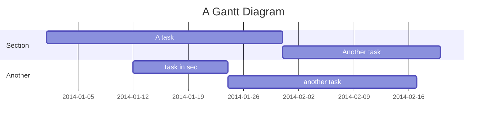
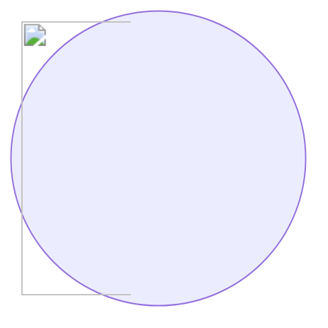

Here I  will introduce and explain the basic notation and special functions of markdown editor. 

# Basic Markdown notation

We will introduce the basic notation from Markdown


## Heading

By writing `#`, a half-width space, and a character string at the beginning of a line, it becomes a heading.
The number of `#` corresponds to the heading level.

```
# This is an h1 tag
## This is an h2 tag
### This is an h3 tag
#### This is an h4 tag
```
↓

## Bullet points

For a bulleted list, enter either `-` `*` and insert a half-width space or tab.
Inserting two or more half-width spaces or a tab at the beginning of a line will nest bullet points.

```
- List 1
- List 2
    - List 2a
         - List 2a1
    - List 2b
```
↓
- List 1
- List 2
    - List 2a
         - List 2a1
    - List 2b

## Numbered list
For a numbered list, enter `<number>.` or `<number>)` and insert a half-width space. Numbering will be done automatically starting from the first number specified.
If you insert two or more half-width spaces or a tab at the beginning of a line, the list will be nested.

```
2. foo
1. bar
1. base
    1. aaa
    1) bbb
    1. ccc
```

↓

2. foo
1. bar
1. base
    1. aaa
    1) bbb
    1. ccc

## Link

 `[Display text](URL)` becomes a link

```
[esa](https://esa.io)
```
↓ 
[esa](https://esa.io)


## Automatic link

`URL` is a link.

However, please note that even if the URL is correct, if the end of the URL is as follows, it will not be an automatic link.
- `?`
- `!`
- `.`
-  `,`
-  `:`
-  `*`
-  `_`
-  `~`

For more information, see [6.9Autolinks (extension)](https://github.github.com/gfm/#autolinks-extension-) in [GitHub Flavored Markdown](https://github.github.com/gfm/). There is a detailed example.

## Image (img)

You can paste an image with ``

```

```
↓


If you want to specify the size, please use the `` tag :pray: (The `` tag is automatically inserted when you upload an image file.)

```

```


You can also attach images and files by copy-pasting them from the clipboard or by adding them into the editor.

## Quote (blockquote)

By inserting `>` at the beginning of a line, it can be displayed as a blockquote.

> This is blockquote
## Emphasis (bold/strong)

Emphasis (bold/strong) can be expressed by surrounding the text with two `*` or `_`.

```
That's my **bait**.
```
↓
That's my **bait**.

## Correction line (del)

A correction line (`del`) can be expressed by surrounding the wording with two `~`s.

```
It's food for the ~~dog~~ bird.
```
↓
It's food for the ~~dog~~ bird.

## Ruled line (hr)

A line containing only three or more `*` `-` and half-width spaces can be expressed as a ruled line (`hr`).

```
End of text.

---

Enjoy! ( ⁰⊖⁰ ) from esa.io
```
↓
End of text.

---

Enjoy! ( ⁰⊖⁰ )

## Table

*The line before the table notation must be blank.

```
| Item name | Price |
| --- | --- |
| Dog food | 250 yen |
| Bird food | 128 yen |
```

↓

| Item name | Price |
| --- | --- |
| Dog food | 250 yen |
| Bird food | 128 yen |

If you want to create a line break within a cell, please use the `<br>` tag.

```
| Item name | Price |
| --- | --- |
| Dog <br>Food | 250 yen |
| Bird <br>Food | 128 yen |
```

↓

| Item name | Price |
| --- | --- |
| Dog <br>Food | 250 yen |
| Bird <br>Food | 128 yen |

The default in a cell is left-aligned, but you can center or right-align it by separating it from the header line with `:---:` or `---:`.

```
| Item name | Price | Notes |
| --- | :---: | ---: | 
| Dog food | 250 yen | Tax included |
| Bird food | 128 yen | Tax included |
| (Left alignment) | (Center alignment) | (Right alignment) |
```
↓

| Item name | Price | Notes |
| --- | :---: | ---: |
| Dog food | 250 yen | Tax included |
| Bird food | 128 yen | Tax included |
| (Left alignment) | (Center alignment) | (Right alignment) |


If you want to specify the column width, please use the `<table>` tag :pray:

```
<table>
  <tr><th width="20">ID</th><th width="780">Item</th></tr>
  <tr><td>1</td><td>Dog food</td></tr>
   <tr><td>1</td><td>Dog food</td></tr>
</table>
```

<table>
  <tr><th width="40">ID</th><th width="760">Item</th></tr>
  <tr><td>1</td><td>Dog food</td></tr>
   <tr><td>1</td><td>Dog food</td></tr>
</table>

- esa table notation is

## Code (code / pre)

### Inline display

```
Inline code is the `<code>` tag.
```
↓
Inline code is the `<code>` tag.

### Code block display

<pre>
```
$ git push origin master
```

</pre>

↓
```
$ git push origin master
```
### Syntax highlighting <span class="esa-extended">Extended notation</span>

<pre>
```ruby
def hex
  puts "( ⁰⊖⁰ )"
end
```

</pre>
↓

```ruby
def hex
  puts "( ⁰⊖⁰ )"
end
```

*Currently, esa uses a library called [rouge](https://github.com/jneen/rouge). The list of supported languages ​​is [here](https://github.com/jneen/rouge/wiki/List-of-supported-languages-and-lexers).

### File name display <span class="esa-extended">Extended notation</span>

<pre>

```ruby:Gemfile
gem 'rails'
gem 'that'
```

```ruby:tori.rb
puts '( ⁰⊖⁰ )'
```

</pre>

```ruby:Gemfile
gem 'rails'
gem 'that'
```

```ruby:tori.rb
puts '( ⁰⊖⁰ )'
```

## Footnotes <span class="esa-extended">Extended notation</span>

`Write like this where you want to add a footnote → [^1]`

`[^1]: Write footnote content here`

:bulb: Reference: [#38: release_note/2014/12/24/Supported footnote method :christmas_tree: :santa:](/posts/38)

## Escape

You can escape symbols used in Makdown with `\ `.

```
\# Hoge

\- high

\\high

(\\( ⁰⊖⁰)/)
```
↓

\# Hoge

\- high

\\high

(\\( ⁰⊖⁰)/)

# Formulas (MathJax/TeX) <span class="esa-extended">Extended notation</span>

## math code block

    ```math
     e^{i \pi} = -1
    ```

```math
 e^{i \pi} = -1
```

## inlineMath

    $a = \\{1, 2, 3\\}$
$a = \\{1, 2, 3\\}$

    $p^{foo}\_{i\\_{bar}}$
$p^{foo}\_{i\_{bar}}$

# Drawing notation <span class="esa-extended">Extended notation</span>

In addition to the basic Markdown notation, esa supports several commonly used and convenient notations for drawing, etc.


## UML ([PlantUML](http://plantuml.com/))

By using PlantUML notation, you can embed UML diagrams such as sequence diagrams into esa articles.

    ```uml
    Alice -> Bob: Authentication Request
    Bob --> Alice: Authentication Response
    
    Alice -> Bob: Another authentication Request
    Alice <-- Bob: Another authentication Response
    ```

```uml
Alice -> Bob: Authentication Request
Bob --> Alice: Authentication Response

Alice -> Bob: Another authentication Request
Alice <-- Bob: Another authentication Response
```

The following parameters are specified by default.

```
skin rose
skinparam monochrome true
scale max 1024 width
```

If you specify `skinparam monochrome false` as shown below, it will be displayed in color.

    ```uml
    skinparam monochrome false

    Alice -> Bob: Authentication Request
    Bob --> Alice: Authentication Response
    
    Alice -> Bob: Another authentication Request
    Alice <-- Bob: Another authentication Response
    ```

```uml
skinparam monochrome false

Alice -> Bob: Authentication Request
Bob --> Alice: Authentication Response

Alice -> Bob: Another authentication Request
Alice <-- Bob: Another authentication Response
```

Also, if the description starts with `@startuml` as shown below, the description inside the code block will be drawn as is.

    ```uml
    @startuml
    Alice -> Bob: Authentication Request
    Bob --> Alice: Authentication Response
    
    Alice -> Bob: Another authentication Request
    Alice <-- Bob: Another authentication Response
    @enduml
    ```

```uml
@startuml
Alice -> Bob: Authentication Request
Bob --> Alice: Authentication Response

Alice -> Bob: Another authentication Request
Alice <-- Bob: Another authentication Response
@enduml
```

You can also use PlantUML beta notation such as `@startmindmap` as shown below.

    ```uml
    @startmindmap
    * root node
        * some first level node
            * second level node
            * another second level node
        * another first level node
    @endmindmap
    ```

```uml
@startmindmap
* root node
	* some first level node
		* second level node
		* another second level node
	* another first level node
@endmindmap
```

reference
- [Language specification page - PlantUML](https://plantuml.com/ja/sitemap-language-specification)
    - [Mind Map Grammar and Functions - PlantUML](https://plantuml.com/ja/mindmap-diagram)

## [Mermaid](https://mermaidjs.github.io/)

Using Mermaid notation, you can embed Gantt charts etc. into esa articles.

    ```mermaid
    gantt
        title A Gantt Diagram
        dateFormat  YYYY-MM-DD
        section Section
        A task           :a1, 2014-01-01, 30d
        Another task     :after a1  , 20d
        section Another
        Task in sec      :2014-01-12  , 12d
        another task      : 24d
    ```



If the __Markdown secure option__ is __Allow use of all tags__, it is also possible to write HTML such as img tags in Mermaid.js. (The status can be checked from "__SETTINGS__" > "__Advanced Settings__" > "__Markdown Secure Options__".)

    ```mermaid
    graph LR
    x(())
    ```




I think it will be useful to be able to embed images in diagrams.


## [uiflow](https://github.com/hirokidaichi/uiflow)

By using the uiflow notation, you can embed a UI Flows graph that connects ``what the user sees'' and ``what the user does'' as a result into an esa article.

<pre class="highlight plaintext"><code>
```uiflow
[page1]
What users see
---
What the user does

[page2]
What users see
---
What the user does
==> page3
What the user does
==> page4

[page3]
What users see

[page4]
What users see
```
</code></pre>


```uiflow
[page1]
What users see
---
What the user does

[page2]
What users see
---
What the user does
==> page3
What the user does
==> page4

[page3]
What users see

[page4]
What users see
```

It is also possible to write multiple lines of ``what the user sees'' and ``what the user does.''
<pre class="highlight plaintext"><code>
```uiflow
[page1]
What users see
(Example of line break)
---
Various things
What the user does
```
</code></pre>

```uiflow
[page1]
What users see
(Example of line break)
---
Various things
What the user does
```

# Other extended notations <span class="esa-extended">Extended notations</span>

In order to be able to use the data with services other than ESA, we have developed it with a policy of not creating unique notations or extensions as much as possible, considering the portability of information. We have incorporated some unique notations and extensions only for the functions that are available.

## Task list <span class="esa-extended">Extended notation</span>

You can create a list with checkboxes

```
- [ ] ALL
    - [ ] ALL
- [x] DONE
```
↓
- [ ] ALL
    - [ ] ALL
- [x] DONE

## Emoji (emoji) <span class="esa-extended">Extended notation</span>

You can display emojis with `:emoji:`.
For more information, please refer to [Emoji cheat sheet](http://www.emoji-cheat-sheet.com/).

 ```
:sushi: :hatched_chick: :bird:
 ```

 :sushi: :hatched_chick: :bird:

- If you type `:` on the editor, the emoji palette will be displayed.
    - 
- Emojis can also be used in post titles and headings.
- You can display members' emojis with `:@SCRENNAME:`.
    - :@ppworks: Hello
- Please check this out for details
    - [#230: help/Using, adding, and customizing emojis](/posts/230)

## Mention <span class="esa-extended">Extended notation</span>

You can mention a specific team member using `@SCRENNAME`.
When you are mentioned, you will be notified from the notification field at the top right of the target user's screen.
If you type `@` in the editor, members of the team will be suggested.

  

## Link to team post <span class="esa-extended">Extended notation</span>

If you type `#` in the editor, posts within the team will be suggested, allowing you to easily post links.


## Alert syntax <span class="esa-extended">Extended notation</span>

- Can highlight important information
    - Please note that if you use too much, the article may become difficult to read.
- For more information, please see the release notes here
    - [#505: ReleaseNotes/2024/03/04/Added alert syntax for GitHub specifications](/posts/505)

```
> [!NOTE]
> Information that is useful for users to know even when skimming the content.

> [!TIP]
> Useful advice to do things better and easier.

> [!IMPORTANT]
> Important information that users need to know to achieve their goals.

> [!WARNING]
> Emergency information that requires the user's immediate attention to avoid problems.

> [!CAUTION]
> Warn about the risks and negative consequences of certain actions.
```

↓

> [!NOTE]
> Information that is useful for users to know even when skimming the content.

> [!TIP]
> Useful advice to do things better and easier.

> [!IMPORTANT]
> Important information that users need to know to achieve their goals.

> [!WARNING]
> Emergency information that requires the user's immediate attention to avoid problems.

> [!CAUTION]
> Warn about the risks and negative consequences of certain actions.

# HTML

In addition to Markdown, you can also use HTML in the esa editor. If you want to express something that cannot be done with Markdown, please consider using HTML.

Some tags and attributes are not available, primarily for security reasons.
This varies depending on the team settings, so please see below for details.

[help/Script tag embedding restrictions (Markdown secure options)](/posts/165)

## Folding (details)

You can collapse part of the article by using the `<details>` tag. When writing Markdown inside, please insert one blank line.

```
<details><summary>詳細</summary>

- This will be collapsed.
    - foo
    - bar
</details>
```

<details><summary>詳細</summary>

- This will be collapsed.
    - foo
    - bar
</details>

# Input assistance

## Table input assistance

We provide unique input aids to make writing Markdown tables easier.


| Key input | Position | Action |
| --- | --- | --- |
| Enter | End of table row | Add new row |
| Tab | In table | Move to next cell |
| Shift + Tab | In table | Move to previous cell |
